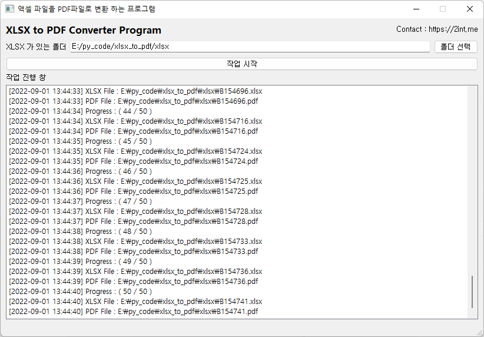

## [파이썬] 엑셀 파일을 PDF 파일로 만드는 프로그램

### 1. 스크린샷



### 2. 파이썬 설치 모듈

- PYQT5
- pywin32
- configparser

```commandline
액셀 파일을 pywin32을 사용 하기 때문에 컴퓨터에 엑셀이 설치 되어 있어야 함.
```

### 3. 특징

- 폴더 선택시 일괄 작업 처리 함. (스크린샷 참고)
- 반복문에서 멈추는 현상이 있어, pyqt thread 사용 함.
- configparser을 이용한 프로그램 설정 자동 저장 (setting.ini)